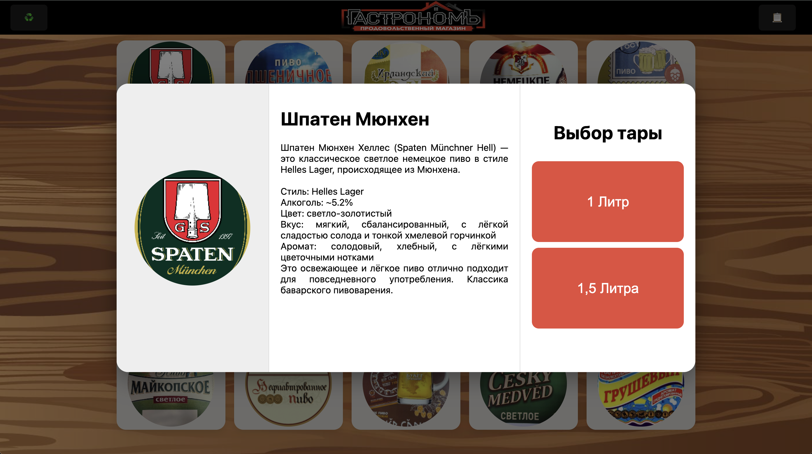
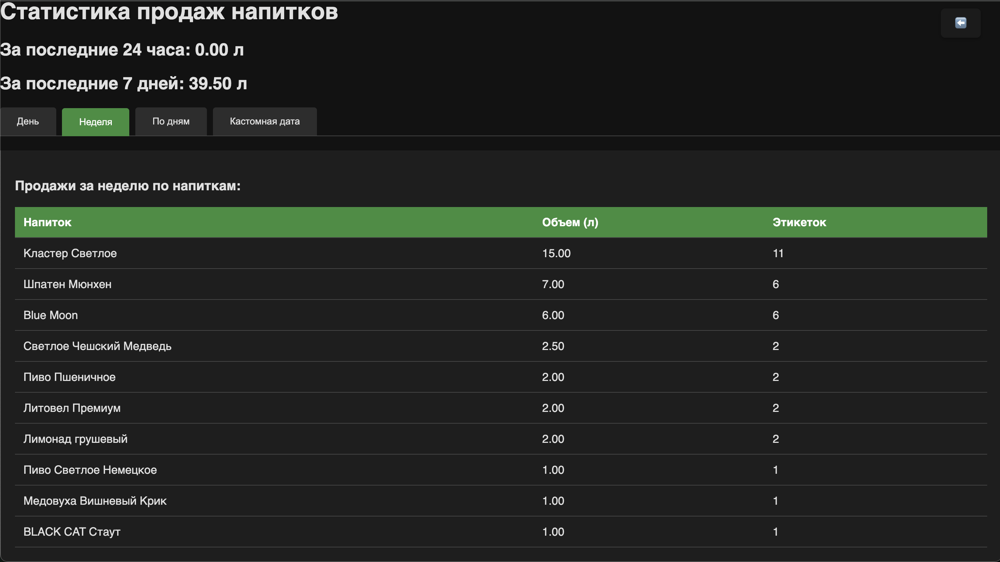

---
# StoreFront

<div align="center">  </div>  

### Описание

StoreFront — это сервис, разработанный на Django, предназначенный для автоматизации продаж разливных напитков в небольших торговых точках и отделах супермаркетов.

Приложение может работать как Web-сервис или устанавливаться на Android и iOS в формате PWA (Progressive Web App).

Система позволяет гибко настраивать витрину товаров, добавлять описания для информирования продавцов, учитывать продажи и автоматически отправлять статистику в Telegram.

Решение ориентировано на небольшие торговые точки.
Интуитивно понятный интерфейс товароведа облегчает управление каталогом, а администраторский интерфейс позволяет настраивать принтеры и шаблоны этикеток без участия IT-специалистов.

> **P.S.** Решение разработано под конкретные задачи одной торговой точки, поэтому избыточные функции кастомизации не закладывались изначально.

---

### Скриншоты
<div align="center">  </div>   
<div align="center">  </div> 


---
### Ограничения и требования

* Поддерживаются только два объёма товара — 1 и 1,5 литра (вся логика построена вокруг этого ограничения).
* Интерфейс предельно простой, без излишней функциональности.
* В качестве сервера может использоваться любой хост; продакшн-версия работает на Raspberry Pi 3B.
* Windows не поддерживает автоматическое определение USB-принтеров.
* Обязательное наличие Docker и Docker Compose.

---

## Основной функционал

* Гибкая настройка витрины с описанием товаров.
* Генерация ZPL-этикеток и отправка их на принтер.
* Поддержка кириллицы для принтеров без встроенных кириллических шрифтов (с использованием Pillow).
* Работа с сетевыми и USB ZPL-принтерами.
* Индивидуальная настройка размера и положения этикеток для каждого принтера.
* Предпросмотр этикеток в административной панели.
* Ролевая модель доступа (администратор / товаровед).
* Автоматическое определение USB-принтеров.
* Автоматическое создание резервных копий через Celery и отправка в Telegram.
* Гибкая статистика с диапазоном дат и ежедневной отправкой в Telegram.
* Очистка базы данных от устаревших записей (старше 90 дней).
* Преднастроенный конфигурационный файл Nginx с поддержкой HTTPS и кеширования (необходимо для PWA).
* Инструменты для генерации самоподписанных SSL-сертификатов.
* Поддержка запуска на x86 и ARM (включая Raspberry Pi) через Docker Compose.
* Адаптивная вёрстка для работы на мобильных устройствах и ПК.
* Автоматическая оптимизация изображений товаров (сжатие и кадрирование).
* Удаление неиспользуемых изображений из системы.
* Поддержка локального домена `.local` и сертификатов для локальных сетей без настроенного DNS (с использованием mDNS).
* Отображение ошибок печати на клиентской стороне.
* Подробные инструкции для персонала в формате PDF.
* Предустановленные пользовательские профили и заполненный каталог товаров.
* Возможность создания дискового образа Raspberry Pi с предустановленным NetBird для удалённого администрирования по SSH (с отдельной инструкцией).

---

### Планы на доработку (TODO)

* Учитывать разрешение принтера (DPI) для масштабирования этикеток.
* Добавить возможность восстановления из резервной копии через административный интерфейс.
* Выделить отдельный location в Nginx для документации.

---

# Развёртывание

> При необходимости создания Raspberry Pi-образа рекомендуется использовать донорский одноплатный компьютер. Виртуализация посредством QEMU возможна, но требует сложной настройки.

### Установка Docker и зависимостей

```bash
sudo apt install -y \
    ca-certificates \
    curl \
    gnupg \
    lsb-release
```

Добавление ключа и репозитория Docker:

```bash
sudo install -m 0755 -d /etc/apt/keyrings
curl -fsSL https://download.docker.com/linux/debian/gpg | sudo gpg --dearmor -o /etc/apt/keyrings/docker.gpg
sudo chmod a+r /etc/apt/keyrings/docker.gpg

echo "deb [arch=$(dpkg --print-architecture) signed-by=/etc/apt/keyrings/docker.gpg] \
https://download.docker.com/linux/debian $(lsb_release -cs) stable" \
| sudo tee /etc/apt/sources.list.d/docker.list > /dev/null
```

Установка Docker Engine:

```bash
sudo apt update
sudo apt install -y docker-ce docker-ce-cli containerd.io docker-buildx-plugin docker-compose-plugin
```

Проверка установки:

```bash
sudo docker version
sudo docker run hello-world
```

(Опционально) добавьте пользователя в группу `docker`:

```bash
sudo usermod -aG docker $USER
newgrp docker  # или перезайдите в систему
```

Создание каталога проекта:

```bash
sudo mkdir /etc/storefront && cd /etc/storefront
sudo chown <USER>:<GROUP> /etc/storefront
```

Создание файла `.env_docker`:

```env
TELEGRAM_BOT_TOKEN = "<YOUR-TOKEN>"
TELEGRAM_CHAT_ID = "<YOUR-CHAT_ID>"
SQLITE_PATH="/app/data/db.sqlite3"
DEBUG="False"
CELERY_BROKER_URL="redis://redis:6379/0"
CELERY_RESULT_BACKEND="redis://redis:6379/0"
```

### Генерация самоподписанного сертификата

Создание приватного ключа:

```bash
openssl genrsa -out nginx/certs/selfsigned.key 2048
```

Указание дополнительных DNS-имён (в `nginx/san.ext`), затем создание сертификата:

```bash
openssl req -new -x509 -key nginx/certs/selfsigned.key -out nginx/certs/selfsigned.crt -days 365 -subj "/CN=storefront.local"
```

Запуск сервиса:

```bash
docker compose up -d --build
```

### Доступ по умолчанию:

```
Администратор: admin / admin  
Товаровед:     tovaroved / tovaroved
```

Если используется пустая база данных:

```bash
python manage.py makemigrations
python manage.py migrate
python manage.py generate_products
python manage.py createsuperuser
```

Измените hostname:

```bash
sudo hostnamectl set-hostname storefront.local
```

Откройте в браузере:

```
https://<ip> или https://storefront.local
```

---

### Работа с USB-принтерами

Добавьте пользователя в нужные группы:

```bash
sudo usermod -aG lp,plugdev <USER>
```

---

### Удалённое администрирование через NetBird (опционально)

Установка:

```bash
curl -fsSL https://pkgs.netbird.io/install.sh | sh
sudo netbird up --setup-key <setup-key>
```

После установки убедитесь, что хост отображается как **Connected** в панели NetBird и доступен по SSH.

---

### Установка на iOS как PWA

1. Перейдите на `https://storefront.local` в Safari.
2. Нажмите «Поделиться» → «На экран домой».
3. Приложение установится с иконкой и откроется без адресной строки браузера.

---

### Подготовка образа диска для развёртывания

> Образ SD-карты (например, на 64 ГБ) будет иметь полный размер карты, даже если реально используется лишь часть. Для оптимизации используйте **PiShrink**.

1. Определите имя подключённого диска:

```bash
diskutil list
```

2. Отмонтируйте диск:

```bash
diskutil unmountDisk /dev/disk5
```

3. Создайте образ:

```bash
sudo dd if=/dev/rdisk5 of=~/Desktop/rpi.img bs=1m status=progress
```

4. Установите PiShrink и уменьшите образ:

```bash
git clone https://github.com/Drewsif/PiShrink && cd PiShrink
docker build -t pishrink .
docker run -it --rm --privileged=true -v $(pwd):/workdir pishrink rpi.img
```

5. Для записи образа используйте `dd`, Raspberry Pi Imager, Balena Etcher и т.д.
