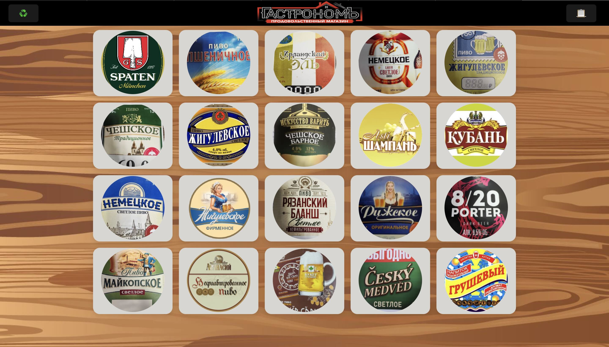
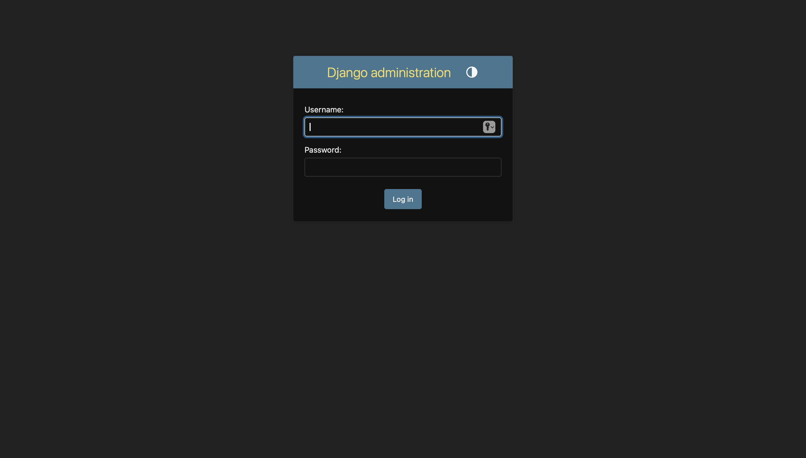
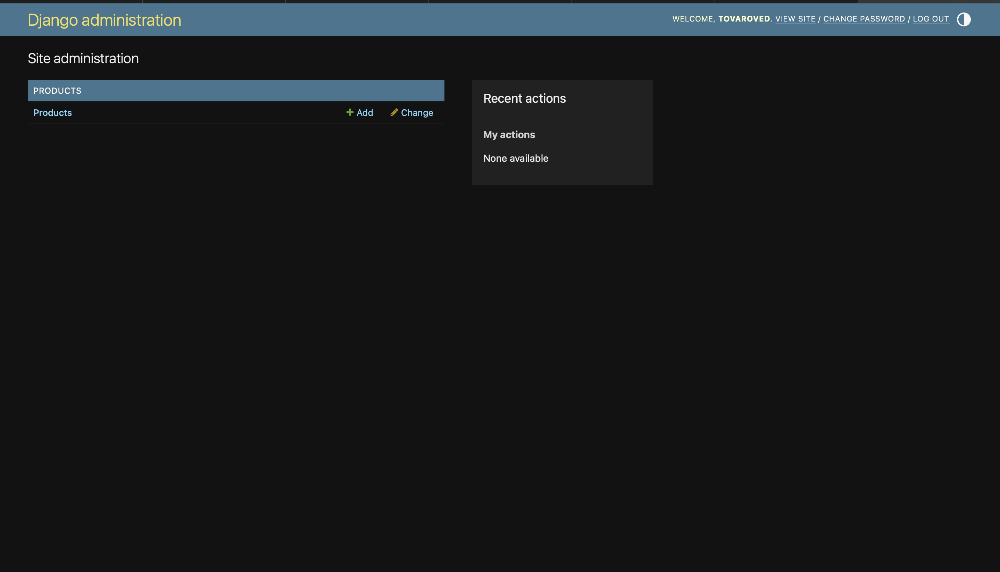
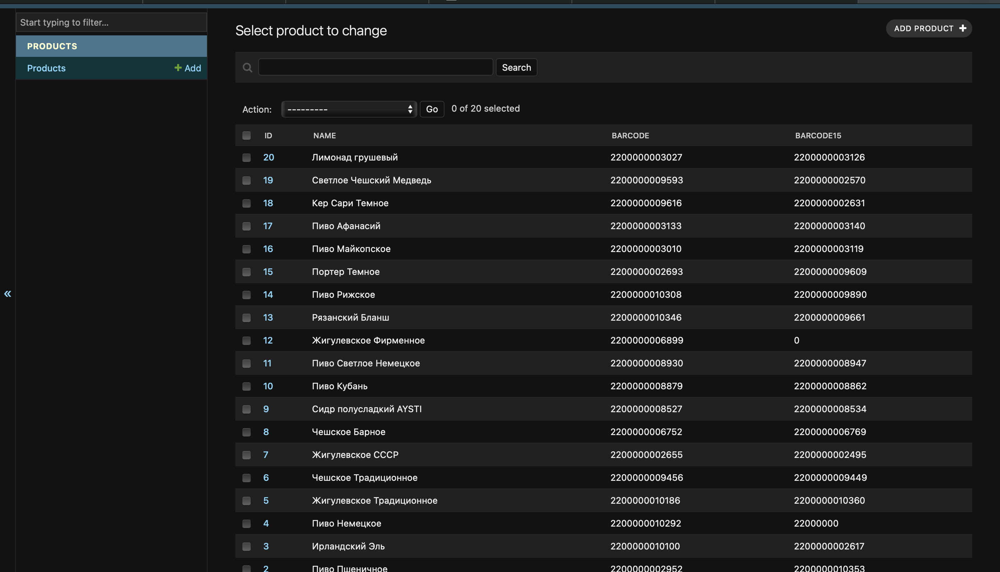
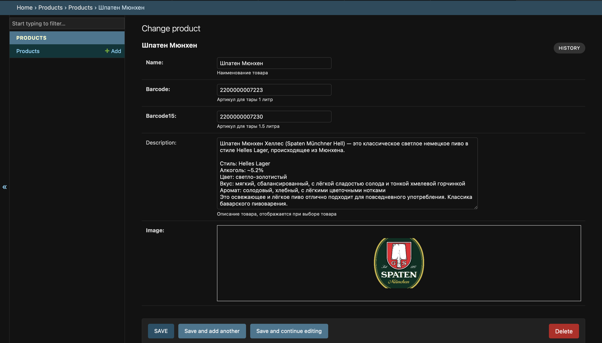
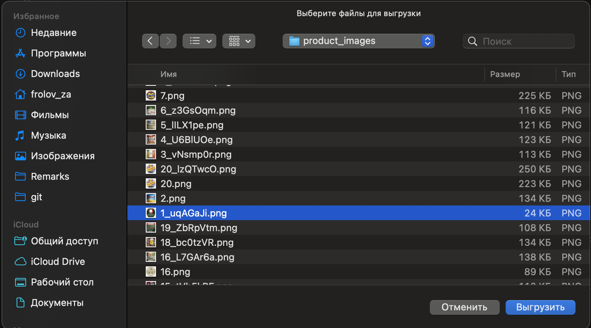
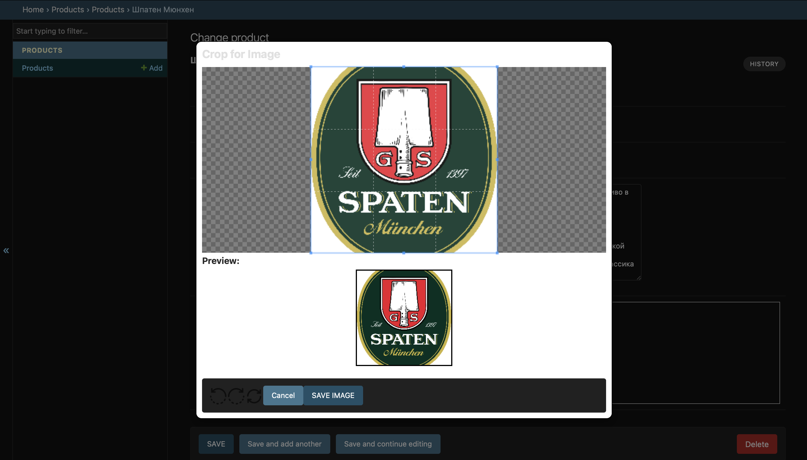

# Создание и обновление товаров в каталоге

### Переход в панель администратора
Откройте главную страницу сайта (каталог товаров).
Нажмите на логотип "Гастроном", откроется форма логина в административную панель

  
  

В форме введи свой логин и пароль и нажми кнопку "Log in"
#### По умолчанию: 
* Username - tovaroved
* Password - tovaroved

  
  

На экране ты увидишь объекты доступные для изменения. В данном случае раздел "Products", перейди в него

  
  
* Кнопка "Add" - быстрый переход к созданию новой карточки товара
* Кнопка "Change" - откроет список товаров для редактирования

### Список товаров
После перехода в раздел, отобразиться список уже ранее добавленных товаров в систему.

  
  

* Кнопка "Add" в правом верхнем углу позволяет добавить новый продукт. После добавления, он отразится на главном экране раздела "Products" и на витрине товаров.
* Кнопка "Delete" удалит карточку товара 

> Форма добавления соответствует форме редактирования.

На экране можно увидеть следующие поля:
* ID - уникальный номер, он же расположение товара на витрине. Это поле уникальное и недоступно для редактиврования. Для изменения последовательности товара на экране витрины, необходимо заменить содержимое конкретного товара.
* Name - поле содержащее наименование товара, значение этого поля передается в этикетку при печати
* Barcode - артикул товара для объема 1 литр
* Barcode15 - артикул товара для объема 1,5 литра

> По полям barcode считается статистика продаж товаров.

### Экран редактирования карточки товара.

  
  

На данном экране доступны для редактирвания указанные выше поля. 
* Поле Description опционально для заполнения. Оно содержит информацию о товаре (его описание), которое отображается на форме выбора объема товара при печати этикетки.

#### Выбор изображения товара

* Поле "Image" предназначено для выбора изображения товара. 

Для замены изображения необходимо кликнуть на текущее, откроется диалоговое окно для выбора файла изображения товара, в нем необходимо выбрать соответсвующее изображение.

  
  

После выбора изображения откроется окно для его кадрирования. По умолчанию изображение кадрируется под квадрат 1:1. При загрузке оно сжимается до размера 320х320, чтобы обеспечить быструю загрузку страницы с витриной товаров.

После кадрирования необходимо нажать кнопку "Save Image" для завершения загрузки изображения.

  
  

### Завершение редактирования карточки товара

На экране формы редактирования товара, в нижней части нажать кнопку "Save", что приведет к сохранению и выходу из карточки товара на экран со списоком товаров.

Описание дополнительных кнопок:
* "Save and Add Another" - сохраняет текущую карточку и открывает форму создания новой карточки товара
* "Save and Continue Editing" - сохраняет текущую карточку, не закрывая ее. Что дает возможность продолжить вносить изменения.

### Завершение редактирования товаров

  
  

На этом редактирование списка товаров и его параметров завершено. 

В правой верхней части экрана нажми кнопку "Log Out" для выхода из панели администратора. 

Так же можно просто перейти на главную страницу витрины товаров, в данном случае для последующего входа в панель администратора логин и пароль вводить не потребуется.
